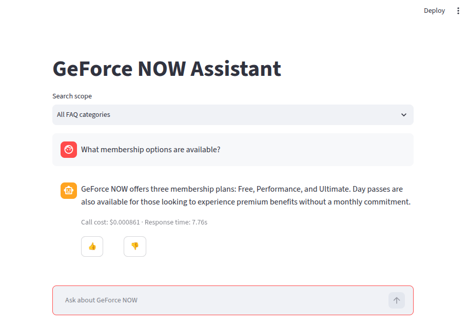
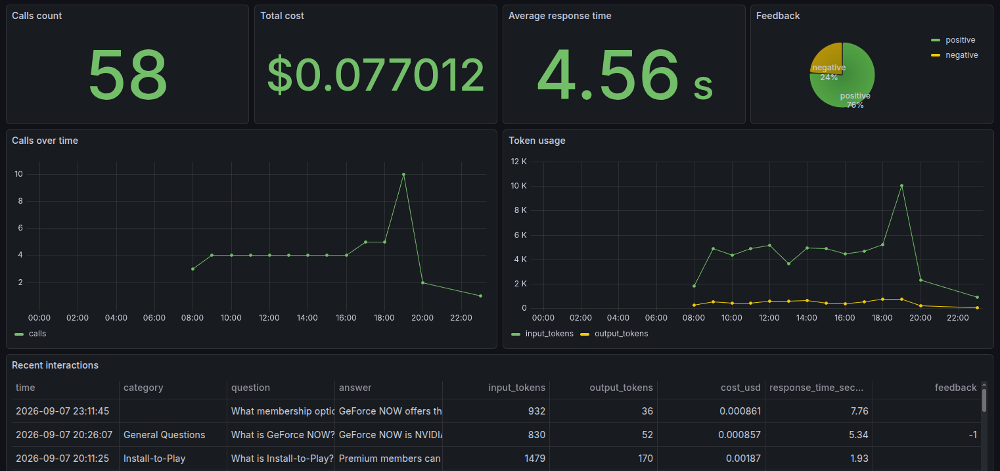

# GeForce NOW Games Assistant


GeForce NOW Games Assistant is a retrieval-augmented generation (RAG) chat
application. It assists in anwsering questions about [NVIDIA GeForce NOW](https://www.nvidia.com/en-us/geforce-now/) service - a cloud gaming service for streaming supported PC games to compatible devices. The application combines lexical and vector FAQ search, asks an OpenAI model for a grounded answer, and records usage metrics and user feedback for monitoring.

This project is a capstone for the [LLM Zoomcamp 2026 course](https://github.com/DataTalksClub/llm-zoomcamp/tree/main) and applies its material on retrieval, RAG evaluation, containerized deployment, and monitoring.

## Prerequisites

- [Docker](https://docs.docker.com/get-docker/) with the
	[Docker Compose plugin](https://docs.docker.com/compose/install/)
- [uv](https://docs.astral.sh/uv/getting-started/installation/)
- An [OpenAI account](https://platform.openai.com/) and
	[API key](https://help.openai.com/en/articles/4936850-where-do-i-find-my-openai-api-key)

Using of OpenAI API may require purchasing a minimum of `$5` in prepaid credits.

Create the environment file:

```bash
cp .env.example .env
```

Open `.env` and replace the placeholder with your API key:

```dotenv
OPENAI_API_KEY=sk-your-key-here
```

The file is ignored by Git. Its remaining variables configure PostgreSQL and
Grafana credentials.

## Quick Start

### Run Assistant App

Build and start the application:

```bash
docker compose up --build
```

- Streamlit assistant: [http://localhost:8501](http://localhost:8501)
- Grafana: [http://localhost:3000](http://localhost:3000)

To try the assistant:

1. Open the Streamlit [link](http://localhost:8501).
2. Optionally select an FAQ category from **Search scope**.
3. Enter a question such as `What membership options are available?` and
	submit it. The grounded answer, call cost, response time, and feedback
	buttons appear in the chat.



To open the monitoring dashboard:

1. Open the Grafana [link](http://localhost:3000) and sign in with `admin` / `admin` by default, or the
	`GRAFANA_ADMIN_USER` and `GRAFANA_ADMIN_PASSWORD` values from `.env`.
2. Select **Dashboards**, open the **Games Assistant** folder, and choose
	**RAG Metrics**.



Stop the stack with `docker compose down`; add `-v` flag to also remove persisted
data and model caches.

### Run Python Scripts And Jupyter Notebooks

Start Elasticsearch service only (it's required for creating data indexes):

```bash
docker compose up -d elasticsearch
```

Create the local uv environment:

```bash
uv sync
```

Python scripts can be run using the created uv environment:

```bash
uv run path/to/script.py
```

For example:

```bash
uv run games_assistant/faq_text_index.py
```

Other scripts use the same `uv run path/to/script.py` pattern.

To run Jupyter notebooks start Jupyter Lab with command:

```bash
uv run jupyter lab
```

Alternatively, open the notebooks in [VSCode](https://code.visualstudio.com/) with the
[VS Code Jupyter extension](https://marketplace.visualstudio.com/items?itemName=ms-toolsai.jupyter)
and select the project's `.venv` kernel.

## Repo Structure

```text
data/
	csv/                         FAQ and evaluation datasets
	scrape_nvidia_faq.py         NVIDIA FAQ scraper
	generate_tags.py             LLM-based tag enrichment
	generate_ground_truth.py     Synthetic evaluation questions
	generate_mock_metrics.py     PostgreSQL metrics generator
games_assistant/
	_basic_rag.ipynb             Text/vector RAG walkthrough
	_evaluation.ipynb            Retrieval and generation evaluation
	faq_*_index.py               Elasticsearch index creation and loading
	faq_*_search.py              Text, vector, and hybrid retrieval
	rag.py                       Retrieval, prompt, and generation pipeline
	ingestion.py                 Default-index ingestion
	app.py                       Streamlit chat interface
	database.py                  PostgreSQL schema and metric persistence
	startup.py                   Container startup initialization
grafana/
	dashboards/                  Versioned dashboard JSON
	provisioning/                Datasource and dashboard provisioning
Dockerfile                     Streamlit application image definition
docker-compose.yaml            Local service orchestration
```

## Data

Source of NVIDIA GeForce NOW FAQ data: [https://www.nvidia.com/en-us/geforce-now/faq/](https://www.nvidia.com/en-us/geforce-now/faq/).


The FAQ data questions were scraped from the source page with [data/scrape_nvidia_faq.py](data/scrape_nvidia_faq.py) python script into [data/csv/geforce_now_faq_raw.csv](data/csv/geforce_now_faq_raw.csv). The data can be recreated from the original page by running the script with command:

```sh
uv run data/scrape_nvidia_faq.py
```

The FAQ dataset was additionally enhanced with a tag column. A tag is an expression that briefly indicates what each question is about. All of the tags were generated with a script [data/generate_tags.py](data/generate_tags.py) that calls OpenAI API with a templated prompt for each FAQ question and saves the enhanced dataset into [data/csv/geforce_now_faq.csv](data/csv/geforce_now_faq.csv).

The calls are done asynchronously with a [`concurrent.futures`](https://docs.python.org/3/library/concurrent.futures.html) module. The responses are returned in a proper format - a `FAQ` pydantic model defined in [data/faq_model.py](data/faq_model.py).

Tags can be recreated by running:
```sh
uv run data/generate_tags.py
```

Tag generation uses the OpenAI API and therefore requires a valid
`OPENAI_API_KEY` in `.env`.

## RAG Flow

[_basic_rag.ipynb](games_assistant/_basic_rag.ipynb) demonstrates the core RAG
steps: creating Elasticsearch indexes, retrieving FAQ context with text or vector
search, augmenting the user question with that context, and generating a grounded
OpenAI response.

It uses following scripts:
- [faq_text_index.py](games_assistant/faq_text_index.py) and [faq_vector_index.py](games_assistant/faq_vector_index.py) for indexing
- [faq_text_search.py](games_assistant/faq_text_search.py) and [faq_vector_search.py](games_assistant/faq_vector_search.py) for retrieval
- [rag.py](games_assistant/rag.py) for the RAG flow
- [constants.py](games_assistant/constants.py) for shared configuration.

## Evaluation

The script [data/generate_ground_truth.py](data/generate_ground_truth.py) was created and used to generate a **Ground Truth** data saved in [data/csv/ground_truth.csv](data/csv/ground_truth.csv). The script uses an OpenAI model to create five natural questions for each of the FAQ entries. This ground-truth
dataset links each sample question to the FAQ entry that should answer it. It
provides a consistent reference for checking whether retrieval returns the
correct FAQ record.

The project evaluates both <u>retrieval</u> and <u>answer generation</u> in
[_evaluation.ipynb](games_assistant/_evaluation.ipynb) notebook, with helper functions
from [evaluation_utils.py](games_assistant/evaluation_utils.py). The notebook
reuses the ground-truth dataset in both evaluation workflows.

### Retrieval Evaluation

1. For every ground-truth question, the notebook runs a search and compares the
	returned results with the FAQ record linked to that question.
2. It measures **hit rate** metric, which checks whether the expected FAQ is returned, and
	**mean reciprocal rank (MRR)** metric, which rewards the expected FAQ appearing near the
	top of the result list.
3. It tests text search with different weights for the *question*, *tag*, and
	*answer* fields, then compares text search and vector search with different
	numbers of returned results.
4. It also tests hybrid search from
	[faq_hybrid_search.py](games_assistant/faq_hybrid_search.py), which combines
	the ranked results from text and vector search using **reciprocal rank fusion
	(RRF)**, with different RRF settings and result counts.


Conclusion: hybrid search with following parameters produced the best retrieval results:
- Boost dict for text search with following field weights: `question=3`, `tag=2`, and `answer=3`
- The reciprocal rank fusion setting: `rank_constant=1`
- Number of top results returned by search function and passed as context to LLM: `7`

The explained above best approach and parameters were implemented in the final application.

### Generation Evaluation

1. The notebook selects 200 sample questions from ground truth and generates an answer for each one
	using the RAG pipeline.
2. An LLM judge classifies every answer as `RELEVANT`, `PARTLY_RELEVANT`, or
	`NON_RELEVANT`.
3. The results compare answer quality and API usage between the 2 tested LLM models: `gpt-5.4-mini` and `gpt-4o`

Conclusion: model `gpt-5.4-mini` gives better results and was chosen to be used in the final application.

## Ingestion

The FAQ data must be loaded into Elasticsearch before the assistant can answer
questions. [ingestion.py](games_assistant/ingestion.py) performs this step: it
connects to Elasticsearch, creates the default text and vector indexes if they
do not exist, and populates indexes that are new or empty from the enriched FAQ
dataset. Indexes that already contain documents are skipped, so repeated
startups do not reload the data. For the vector index, tags, questions, answers,
and the combined question/answer text are converted into embeddings with a `all-MiniLM-L6-v2`
model from Sentence Transformers library.

In this project ingestion runs at application startup, which keeps the setup
simple to reproduce. In a production environment, steps such as scraping, tag
generation, validation, and index creation should be separate scheduled tasks in
an orchestrator such as [Kestra](https://kestra.io/) or
[Apache Airflow](https://airflow.apache.org/). Such a setup provides retries,
observability, data-quality checks, and atomic index replacement, instead of
coupling data refresh to application startup.

## Containerized Application

[app.py](games_assistant/app.py) implements the Streamlit chat interface, with
optional filtering by FAQ category. Each submitted question is answered with
hybrid search configured using the parameters selected during evaluation. The
retrieved FAQ entries are sent to OpenAI as context, and the resulting grounded
answer is displayed together with its cost and thumbs-up/thumbs-down feedback
buttons.

Container startup is handled by [startup.py](games_assistant/startup.py), which
verifies that Elasticsearch is available, runs ingestion, creates the PostgreSQL
tables, and then starts Streamlit. All services - Elasticsearch, PostgreSQL,
Streamlit, and Grafana - are orchestrated by
[docker-compose.yaml](docker-compose.yaml), which defines health checks and
persistent volumes.

Every successful call is stored in PostgreSQL with its question, answer,
complete prompt, input and output token counts, estimated cost, response time,
category, timestamp, and optional rating. These records are the data source for
the monitoring dashboard.

## Monitoring

The **RAG Metrics** dashboard is provisioned automatically and requires no
manual configuration. It refreshes every 30 seconds and contains the following
panels:

| Panel | Type | Description |
| --- | --- | --- |
| Calls count | stat | Number of interactions in the selected time range |
| Total cost | stat | Sum of the estimated call cost in USD |
| Average response time | stat | Mean response time in seconds |
| Feedback | pie chart | Share of positive and negative ratings |
| Calls over time | time series | Interaction count grouped into one-hour buckets |
| Token usage | time series | Input and output tokens summed per hour |
| Recent interactions | table | Last 100 calls with time, category, question, answer, tokens, cost, response time, and feedback |

The PostgreSQL datasource is defined in
[grafana/provisioning/datasources/postgres.yaml](grafana/provisioning/datasources/postgres.yaml),
dashboard discovery in
[grafana/provisioning/dashboards/dashboards.yaml](grafana/provisioning/dashboards/dashboards.yaml),
and the panel definitions in
[grafana/dashboards/rag-metrics.json](grafana/dashboards/rag-metrics.json).

Because a newly created dashboard contains no data, sample records can be added
for demonstration purposes. After the application has created the database
table, populate the dashboard with 50 mock interactions spread across the last
12 hours:

```bash
uv run data/generate_mock_metrics.py
```

The script runs on the host, connects to PostgreSQL on `localhost:5434`, makes
no LLM calls, and only inserts rows into the existing table. Use `--count`,
`--hours`, `--seed`, or `--database-url` to override its defaults.